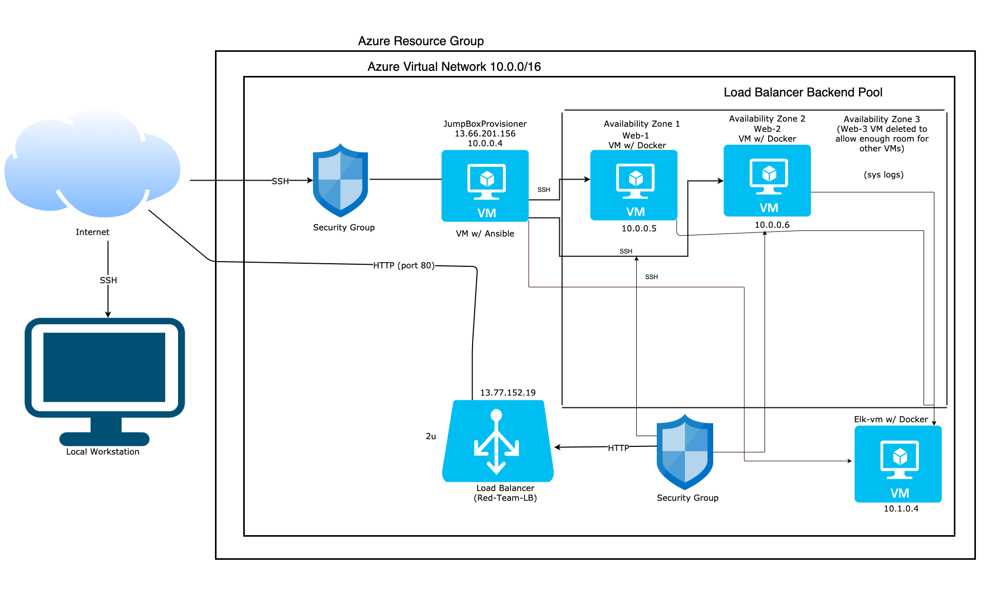

## Automated ELK Stack Deployment

The files in this repository were used to configure the network depicted below.

**Note**: The following image link needs to be updated. Replace `diagram_filename.png` with the name of your diagram image file.  

These files have been tested and used to generate a live ELK deployment on Azure. They can be used to either recreate the entire deployment pictured above. Alternatively, select portions of the _____ file may be used to install only certain pieces of it, such as Filebeat.


  - _TODO: Enter the playbook file._

  - Your final playbook should read similar to:

    ```
    ---
    - name: Config Web VM with Docker
      hosts: webservers
      become: true
      tasks:
      - name: docker.io
        apt:
          force_apt_get: yes
          update_cache: yes
          name: docker.io
          state: present
    
      - name: Install pip3
        apt:
          force_apt_get: yes
          name: python3-pip
          state: present
    
      - name: Install Docker python module
        pip:
          name: docker
          state: present
    
      - name: download and launch a docker web container
        docker_container:
          name: dvwa
          image: cyberxsecurity/dvwa
          state: started
          published_ports: 80:80
    
      - name: Enable docker service
        systemd:
          name: docker
          enabled: yes
    ```

This document contains the following details:
- Description of the Topology 

  ​	First we installed Docker.io, then we installed pip3, then we launched Docker module

- Access Policies

  - Enabled for all vm users on the network & my personal ip

- ELK Configuration
  - Beats in Use: FileBeats, MetricBeats & Packetbeats
  - Machines Being Monitored: 2 Webservers-Web-1 & Web-2
  
- How to Use the Ansible Build: Use it by running Ansible-playbook followed by the name of the .yml file


### Description of the Topology

The main purpose of this network is to expose a load-balanced and monitored instance of DVWA, the D*mn Vulnerable Web Application.

Load balancing ensures that the application will be highly _<u>available</u>____, in addition to restricting <u>access</u> to the network.
- _TODO: What aspect of security do load balancers protect? _

  ​		Load balancers protect from DoS (Denial of Service attacks)_

  - What is the advantage of a jump box?_
    - It allows us to SSH into the other machines

Integrating an ELK server allows users to easily monitor the vulnerable VMs for changes to the <u>logs</u> and system <u>traffic</u>_.
- _TODO: What does Filebeat watch for?_

  ​	Filebeat forwards and centralizes log data. Filebeat monitors the log files or locations specified, collecting log events,  sending them to Elasticsearch or Logstash for indexing.

- _TODO: What does Metricbeat record?_

  - Metricbeat records metrics from the operating system and from services running on the server to show cpu usage for example. It takes the metrics and statistics that it collects and ships them to the output that you specify, such as Elasticsearch or Logstash.

The configuration details of each machine may be found below.
_Note: Use the [Markdown Table Generator](http://www.tablesgenerator.com/markdown_tables) to add/remove values from the table_.

| Name               | Function    | IP Address | Operating System |
| ------------------ | ----------- | ---------- | ---------------- |
| JumpBoxProvisoiner | Gateway     | 10.0.0.1   | Linux            |
| Web-1              | WebServers  | 10.0.0.5   | Linux            |
| Web-2              | WebServers  | 10.0.0.6   | Linux            |
| ELK-vm             | Log Display | 10.1.0.4   | Linux            |

### Access Policies

The machines on the internal network are not exposed to the public Internet. 

Only the JumpBox machine can accept connections from the Internet. Access to this machine is only allowed from the following IP addresses:
- _TODO: Add whitelisted IP addresses_

  52.175.250.204 (public ip)

Machines within the network can only be accessed by <u>JumpBox</u>__.
- _TODO: Which machine did you allow to access your ELK VM? What was its IP address?_

A summary of the access policies in place can be found in the table below.

| Name               | Publicly Accessible | Allowed IP Addresses |
| ------------------ | ------------------- | -------------------- |
| JumpBoxProvisoiner | Yes                 | 52.175.250.204       |
| Web-1              | No                  | Network IPs          |
| Web-2              | No                  | Network IPs          |

### Elk Configuration

Ansible was used to automate configuration of the ELK machine. No configuration was performed manually, which is advantageous because...
- _TODO: What is the main advantage of automating configuration with Ansible?_
  - It creates a container to automate tasks

The playbook implements the following tasks:
- _TODO: In 3-5 bullets, explain the steps of the ELK installation play. E.g., install Docker; download image; etc._
- Install Docker.io
- Install pip3
- Install Docker python module
- Use sysctl module
      - name: Use more memory

The following screenshot displays the result of running `docker ps` after successfully configuring the ELK instance.


**Note**: The following image link needs to be updated. Replace `docker_ps_output.png` with the name of your screenshot image file.  

### Target Machines & Beats
This ELK server is configured to monitor the following machines:
- _TODO: List the IP addresses of the machines you are monitoring_
  - Web-1 10.0.0.5
  - Web-2 10.0.0.6

We have installed the following Beats on these machines:
- _TODO: Specify which Beats you successfully installed_
  - metricbeat & filebeat

These Beats allow us to collect the following information from each machine:
- Filebeat checks to see which file has been accessed and modified. Expect to see log data. 
- Metricbeat shows cpu usage and ram using as well as other metrics of the system performance. Examples include seeing a spike in cpu usage when files are requested

### Using the Playbook

In order to use the playbook, you will need to have an Ansible control node already configured. Assuming you have such a control node provisioned: 

SSH into the control node and follow the steps below:
- Copy the _____<u>Playbook</u> file to <u>Ansible</u>.
- Update the <u>playbook</u> file to include the <u>hostname</u>
- Run the playbook, and navigate to <u>container that was created</u> to check that the installation worked as expected.

_TODO: Answer the following questions to fill in the blanks:_
- the .yml file is the playbook & it is copied to the Ansible container
- To make Ansible run the playbook on a specific machine the host file needs to be updated
- To specify which machine to install the ELK server on versus which to install Filebeat by using the ip addresses
- Navigate to the private ip of the ELK server @ 10.1.0.4 to ensure it's running

_As a **Bonus**, provide the specific commands the user will need to run to download the playbook, update the files, etc.

$ ansible-playbook install_elk.yml elk
$ ansible-playbook install_filebeat.yml webservers
$ ansible-playbook install_metricbeat.yml webservers